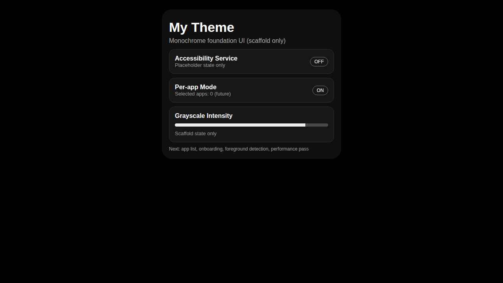

# My Theme (Android)

A lightweight Android app project focused on reducing eye strain with a black-and-white / grayscale experience, targeting **per-app behavior** as far as Android constraints allow.

## Why this exists
- Long daily screen time can increase eye fatigue.
- A muted monochrome style can lower visual intensity.
- The product direction prioritizes low battery usage, minimal resource cost, and practical Android compatibility.

## Current status
This repository now contains:
- A minimal Kotlin + Jetpack Compose Android app shell
- Placeholder UI sections for:
  - selected-app list
  - grayscale intensity/mode settings
  - onboarding for required services/permissions
- GitHub Actions workflow that builds a debug APK and uploads it as an artifact
- Product/engineering roadmap in [`docs/ROADMAP.md`](docs/ROADMAP.md)

## What is intentionally not implemented yet
- Per-app grayscale behavior across other apps is **not implemented yet** in runtime.
- Accessibility service state in the app shell is **placeholder UI** only.
- Grayscale intensity control is currently **scaffold state only** and does not apply filters yet.

## Initial app shell preview

## Android constraints (important)
Android does not provide a simple public API for forcing true per-app grayscale rendering in arbitrary third-party apps.
Practical approaches involve trade-offs (accessibility service, overlay/filter behavior, quick settings + foreground control patterns, OEM/root/device-owner constraints).
See roadmap for feasibility details.

## Build APK with GitHub Actions (no PC workflow)
1. Push changes to GitHub.
2. Open the **Actions** tab.
3. Run or inspect **Android CI - Build Debug APK**.
4. Download the `app-debug-apk` artifact from the workflow run.

## Next steps
- Implement selected app list and persistence.
- Build permission/onboarding flow for required services.
- Add accessibility-based foreground app detection.
- Optimize battery, memory, and rendering behavior.
